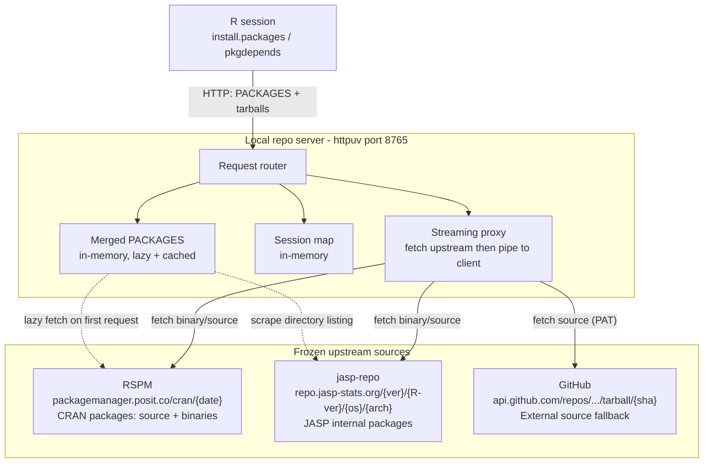
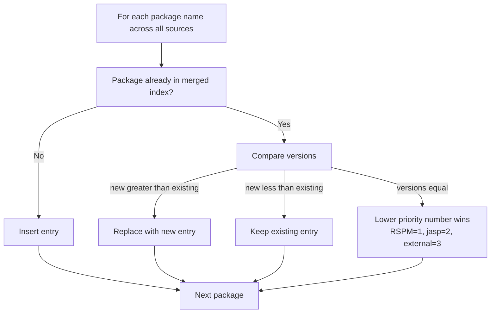
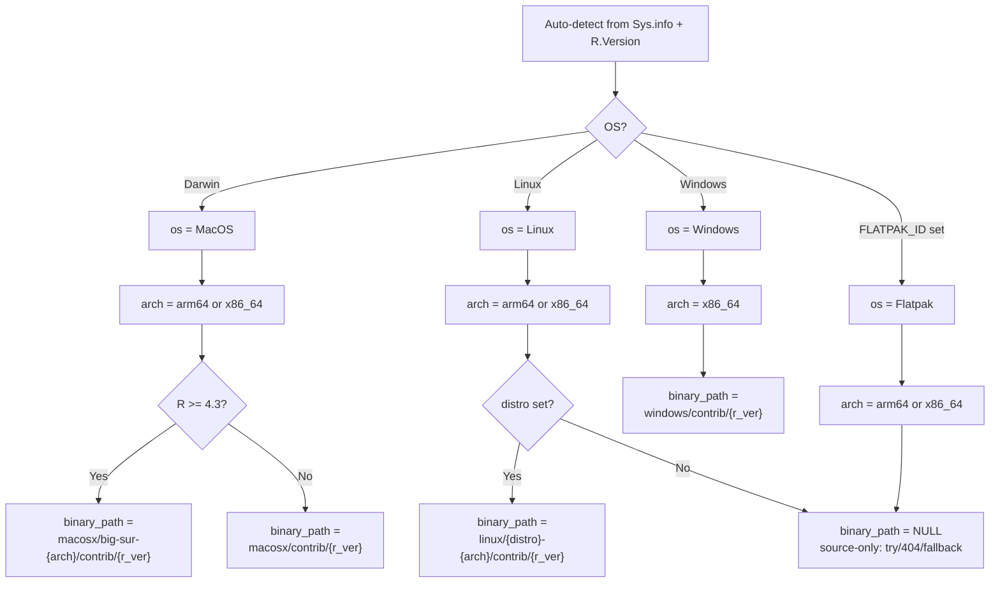
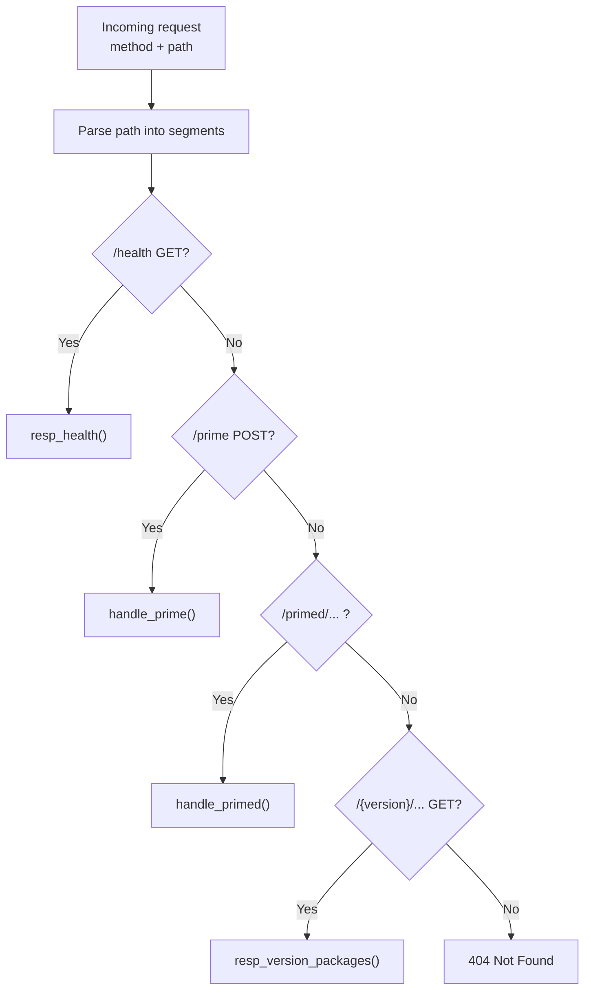
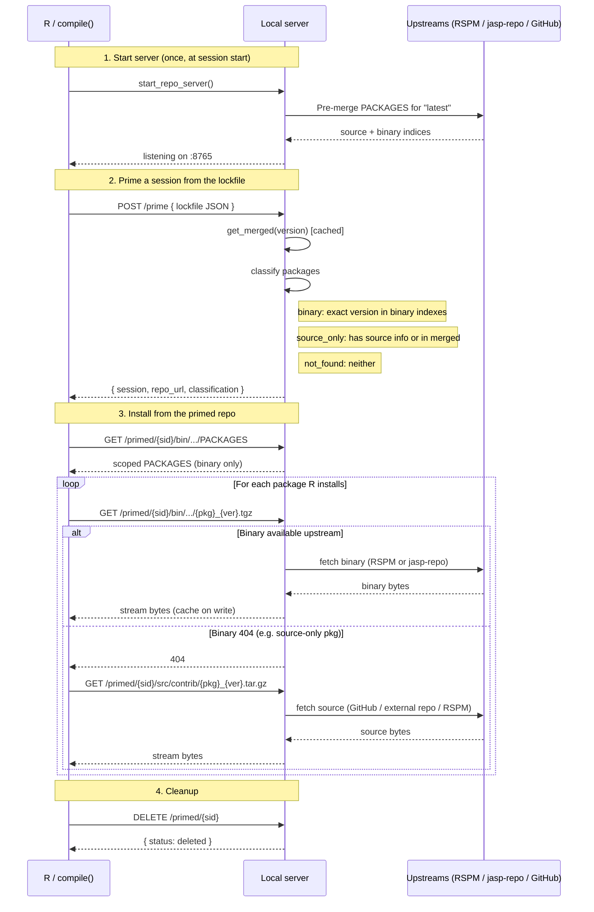
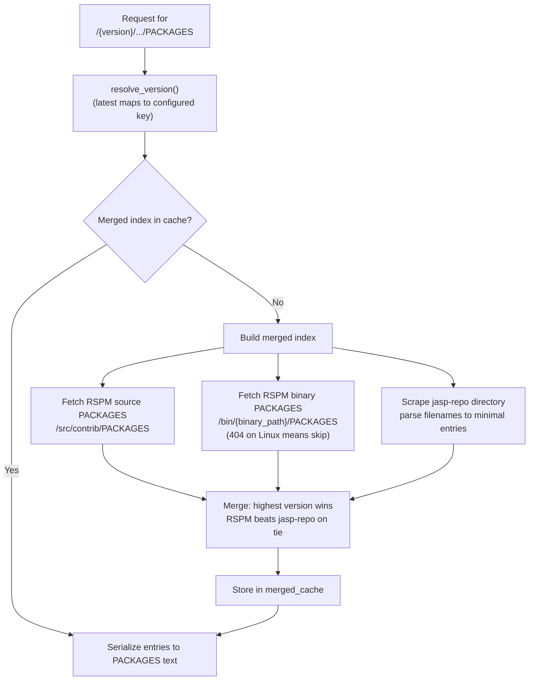
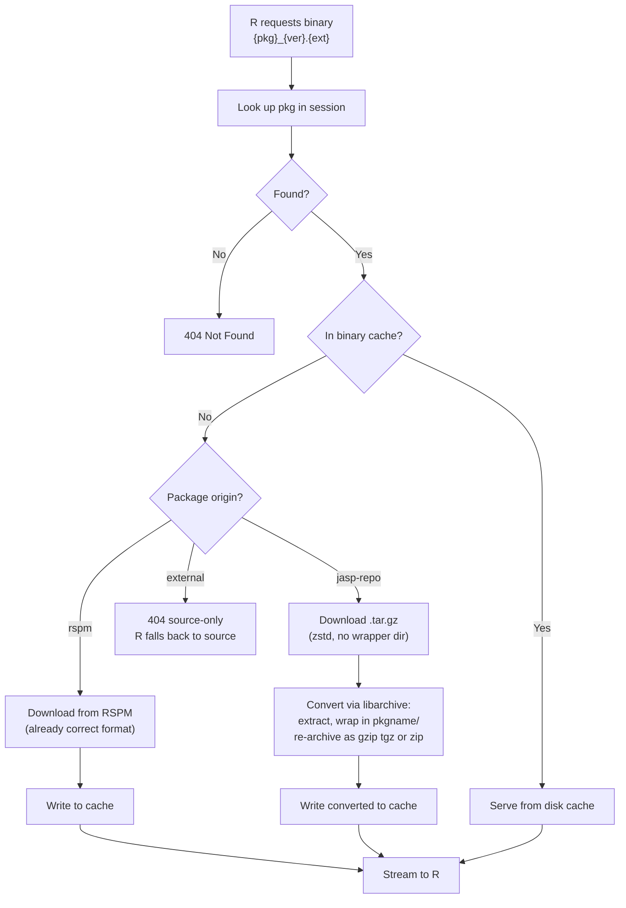
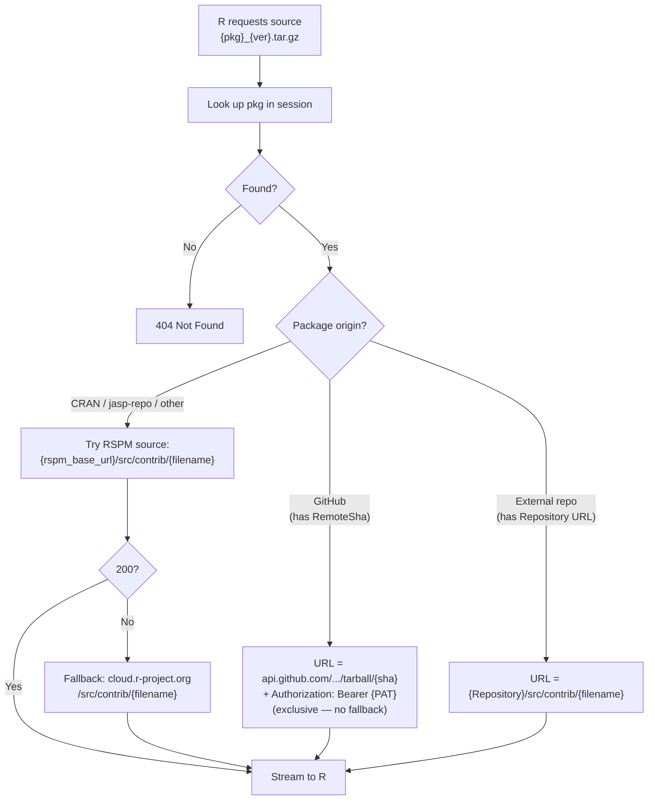
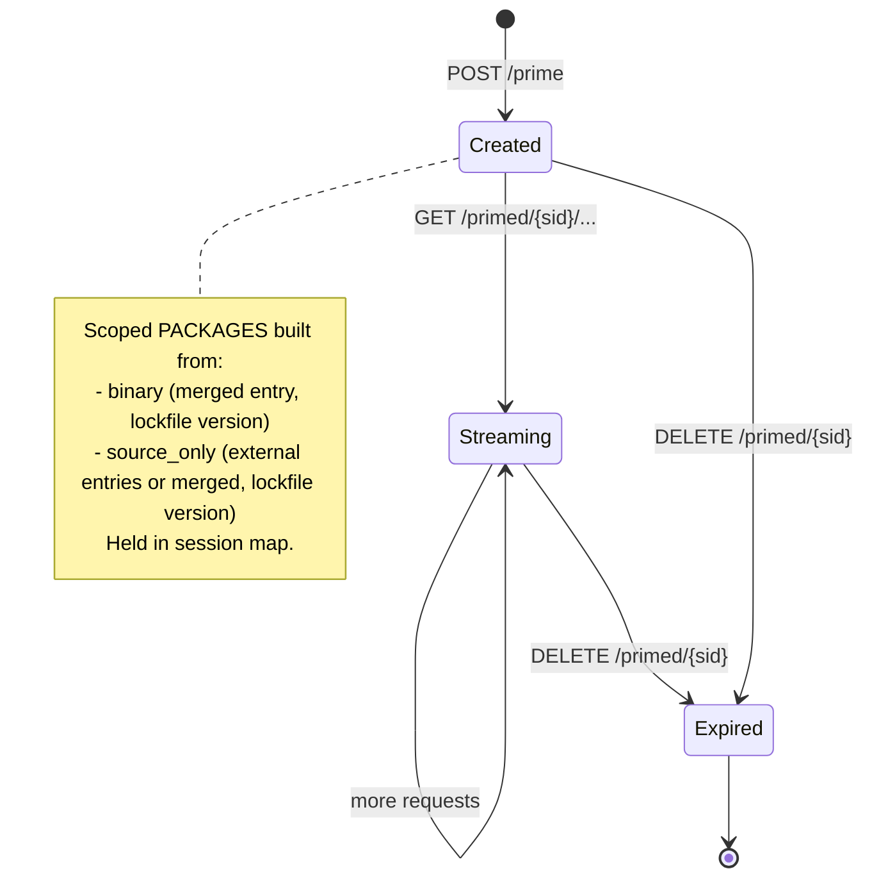
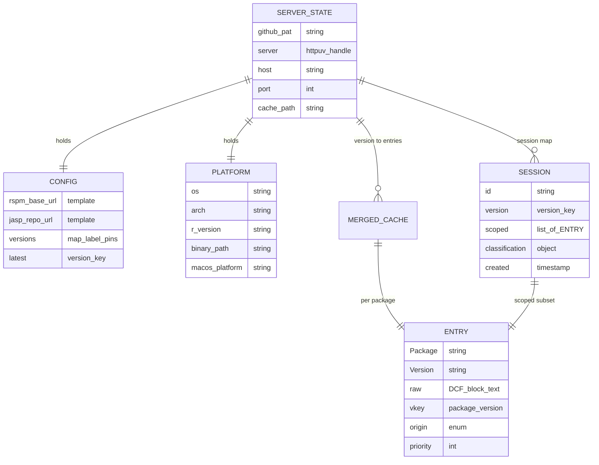

# JASP Local Repo Server — Documentation

> **Implementation:** `inst/tools/repo_server.R` (Phase 1)
> **Spec:** `inst/tools/SPEC.md` (v2.1)
>
> A pure streaming proxy that exposes a **merged, version-pinned, CRAN-like
> repository** on `localhost`. R's `install.packages()` / `pkgdepends` talk to
> it like any normal repo — no `renv` internals, no cellar, no disk cache.

---

## 1. High-level architecture

The server sits between R and three upstream package sources. It holds only
in-memory metadata; every binary/source tarball is fetched on demand and
streamed straight to R without touching disk.



**Key properties:**

- **Streaming proxy with optional cache** — binaries are fetched from upstream
  and streamed to R. jasp-repo binaries are converted to the format R expects
  (gzip `.tgz` / `.zip` with a wrapper directory) on first download, then cached
  on disk for subsequent requests. RSPM binaries are cached as-is.
- **In-memory metadata** — the merged index and session map live for the
  duration of the R session that started the server. No persistence, no crash
  recovery.
- **Version-pinned** — each version key pins both a RSPM snapshot date and a
  jasp-repo label, giving a fully deterministic dependency set.
- **Single-threaded for R callbacks** — `httpuv` serializes R callbacks. R's
  default `install.packages()` is sequential, so this is not a correctness issue
  (parallel downloads via `Ncpus`/`pkgdepends` will serialize).

---

## 2. The three package sources

| Source | Priority | What it provides | URL pattern |
|--------|----------|------------------|-------------|
| **RSPM** | 1 (highest) | Canonical CRAN packages, source + binaries | `/cran/{date}/...` |
| **jasp-repo** | 2 | JASP internal packages (**binary only**) | `/{version}/{R-version}/{os}/{arch}/` |
| **External** | 3 (lowest) | Source-only fallback from the lockfile | GitHub tarballs, external repos |

> **jasp-repo is binary-only.** Its `.tar.gz` files are zstd-compressed R binary
> packages with files at the top level (no `pkgname/` wrapper directory). R's
> `install.packages(type="binary")` expects gzip `.tgz` (macOS) / `.zip`
> (Windows) / gzip `.tar.gz` (Linux) with a `pkgname/` wrapper. The server
> converts jasp-repo binaries on first download using libarchive (auto-detects
> compression) and caches the result. Source requests for jasp-repo packages
> return 404.

### Merge rule

**Highest version wins.** Source priority (RSPM > jasp-repo > External) only
breaks ties when the *same* version appears in multiple sources.



### jasp-repo directory scraping

jasp-repo serves an Apache directory index. The server scrapes `<a href>` entries
and builds minimal `PACKAGES` entries (`Package` + `Version` from filename only):

```
jaspAnova_0.95.5.tar.gz   →  Package: jaspAnova, Version: 0.95.5   ✓ (version pattern)
jaspAnova_120339c6.tar.gz →  ignored (8-char commit SHA, fails version pattern)
jaspBase_2aaba080.tar.gz  →  ignored (commit SHA)
```

Filter: `^\d+([.\-]\d+)*$` — must start with digits and use only `.` or `-`
separators. Commit SHAs and junk are silently dropped.

---

## 3. Platform resolution

At startup, the server resolves platform parameters that determine which RSPM
binary paths are fetched and how jasp-repo URLs are constructed:



> **Note:** jasp-repo uses `macosx` (CRAN's legacy name), **not** `macos`. R 4.3+
> appends a `big-sur-{arch}` platform directory. The path is constructed from
> the runtime arch — it cannot assume a fixed string.

> **jasp-repo OS labels:** `MacOS`, `Windows`, `Flatpak`. There is no `Linux/`
> directory on jasp-repo — plain Linux dev machines (without `FLATPAK_ID`) get
> source-only from jasp-repo, consistent with the "404 → source" policy.

---

## 4. HTTP API

Default: `http://localhost:8765`

### 4.1 Versioned metadata endpoints

Serve the full merged `PACKAGES` for a pinned version. Used by
`updateLockfile()` / `pkgdepends` for dependency resolution.

| Method | Path |
|--------|------|
| `GET` | `/{version}/src/contrib/PACKAGES` |
| `GET` | `/{version}/bin/{binary_path}/PACKAGES` |
| `GET` | `/latest/src/contrib/PACKAGES` |
| `GET` | `/latest/bin/{binary_path}/PACKAGES` |

`{binary_path}` is wildcard-matched — the server serves whatever binary path R
requests for the current platform (e.g.
`macosx/big-sur-arm64/contrib/4.5` or `windows/contrib/4.5`).
`PACKAGES.gz` variants are also served (gzip-compressed).

### 4.2 Primed session endpoints

#### `POST /prime`

Submits a lockfile; the server classifies packages and creates a scoped session.

**Request body** (renv lockfile JSON):

```json
{
  "R":     { "Version": "4.5.0" },
  "JASP":  { "RepoVersion": "9120" },
  "Packages": {
    "ggplot2":    { "Package": "ggplot2", "Version": "3.5.1", "Source": "Repository" },
    "jaspGraphs": { "Package": "jaspGraphs", "Version": "0.11.2", "Source": "GitHub",
                    "RemoteUsername": "jasp-stats", "RemoteRepo": "jaspGraphs",
                    "RemoteSha": "abc123def456" }
  }
}
```

**Response:**

```json
{
  "session": "a3f8c2d1e9B4",
  "repo_url": "http://localhost:8765/primed/a3f8c2d1e9B4",
  "package_count": 47,
  "binary": 43,
  "source_only": ["jaspGraphs"],
  "not_found": []
}
```

| Field | Type | Description |
|-------|------|-------------|
| `session` | string (12 chars) | Random alphanumeric session ID |
| `repo_url` | string | Base URL for `install.packages(type="binary")` |
| `package_count` | integer | Number of packages in scoped PACKAGES (binary + source_only) |
| `binary` | integer | **Count** of packages classified as binary — not a list of names |
| `source_only` | string[] | Package names to install from source |
| `not_found` | string[] | Package names with no install path |

**Classification buckets:**

| Bucket | Criterion | Scoped PACKAGES |
|--------|-----------|-----------------|
| `binary` | **Exact version** match in RSPM binary index or jasp-repo binary index | Merged DCF entry, Version pinned to lockfile |
| `source_only` | No binary match, but either: (a) record has source info (GitHub SHA / Repository URL), **or** (b) package exists in the merged index (known to a pinned source) | (a) External entry with remote metadata, or (b) merged DCF entry with Version pinned to lockfile |
| `not_found` | No binary match, no source info, and not in merged index | Excluded (returned so client can warn) |

> **Classification is based on binary indexes, not the full merged index.**
> RSPM binary PACKAGES and jasp-repo directory listing are fetched fresh per
> prime request; the merged index is only used as a fallback for packages that
> have no binary match and no source info.

#### Scoped PACKAGES

| Method | Path | Contents |
|--------|------|----------|
| `GET` | `/primed/{session}/src/contrib/PACKAGES` | **All installable** lockfile packages (`binary` + `source_only`; `not_found` excluded). Binary entries use merged DCF (Version patched to lockfile); source_only entries carry external metadata or patched-version merged DCF. |
| `GET` | `/primed/{session}/bin/{binary_path}/PACKAGES` | **Binary-classified packages only.** `source_only` packages are excluded — R would try binary → 404 → skip instead of falling back to source. |

#### Streaming tarball endpoints

| Method | Path | Behavior |
|--------|------|----------|
| `GET` | `/primed/{session}/bin/{binary_path}/{pkg}_{ver}.{tgz,tar.gz,zip}` | Stream binary from upstream; 404 → R falls back to source |
| `GET` | `/primed/{session}/src/contrib/{pkg}_{ver}.tar.gz` | Stream source from upstream |

#### `DELETE /primed/{session}`

Expires a session. `compile()` should call this on exit (via `withr::defer()`)
to avoid session accumulation.

### 4.3 Health

`GET /health` →

```json
{"status":"ok","versions":["9120","8975"],"latest":"9120","sessions":3}
```

---

## 5. Request flow (low-level)

### 5.1 Router

All HTTP requests pass through a single `handle_request()` dispatcher:



### 5.2 Prime + install sequence

This is the main `compile()` flow — prime a session, then install from it:



### 5.3 Lazy merge + PACKAGES request

The merged index is built lazily on first access for a version, then cached:



### 5.4 Binary streaming (cache + conversion)

Binary requests check the cache first. On a miss, RSPM binaries are downloaded
and cached as-is. jasp-repo binaries are downloaded, converted (decompress via
libarchive, wrap in pkgname/, re-archive as gzip tgz/zip), then cached.



### 5.5 Source streaming

Source requests resolve the upstream URL by origin. For GitHub packages the
git tarball is used exclusively; for others RSPM source is tried first with
a live CRAN fallback. jasp-repo packages that end up in `source_only` are
treated as CRAN packages (step 3) — they'll 404 unless they happen to exist
on CRAN.



### 5.6 Binary format conversion (jasp-repo)

jasp-repo binaries need conversion before R can use them:

| | jasp-repo (input) | R expects (output) |
|---|---|---|
| **Compression** | zstd | gzip (macOS/Linux) or zip (Windows) |
| **Extension** | `.tar.gz` | `.tgz` (macOS) / `.zip` (Windows) / `.tar.gz` (Linux) |
| **Structure** | files at root | wrapped in `pkgname/` directory |

The conversion uses `archive::archive_extract()` (libarchive) which auto-detects
compression from the file content — so when jasp-repo renames files to `.tar.zst`
or changes compression later, nothing in the server needs to change.

Re-archiving uses R's built-in `tar(compression = "gzip")` (portable, Windows-safe)
or `utils::zip()` for Windows binaries.

---

## 6. Session lifecycle



Sessions are short-lived: `compile()` creates one, installs from it, then
deletes it. If deletion is skipped (e.g. crash), the session dies with the R
session that started the server.

---

## 7. In-memory data model

### Global state (`.repo_server_state`)



### Entry representation

Each package is stored as a **raw DCF text block** plus parsed metadata. This
preserves every original field (Depends, Imports, ...) for RSPM passthrough,
while jasp-repo entries get minimal `Package` + `Version` blocks:

```
RSPM entry:                          jasp-repo entry:
  Package: ggplot2                     Package: jaspAnova
  Version: 3.5.1                       Version: 0.95.5
  Depends: R (>= 3.3)
  Imports: ...                         (no other fields —
  Suggests: ...                         derived from filename)
  MD5sum: ...
  ...
```

---

## 8. Getting started

### Prerequisites

```r
install.packages(c("httpuv", "curl", "jsonlite", "archive"))
```

`archive` (libarchive binding) is needed for jasp-repo binary conversion.
Without it, jasp-repo binaries cannot be served (RSPM binaries still work).

### Quick start

```r
source("inst/tools/repo_server.R")

# Start with auto-detected platform (binds 127.0.0.1:8765)
start_repo_server()

# Check health
curl::curl_fetch_memory("http://localhost:8765/health")

# Stop
stop_repo_server()
```

### Platform overrides

```r
# Override R version (e.g. to match a jasp-repo snapshot)
start_repo_server(r_version = "4.5")

# Try Linux binaries (RSPM linux path; 404 → source fallback)
start_repo_server(distro = "noble")

# Provide a GitHub PAT for source fallback (or set GITHUB_PAT env var)
start_repo_server(github_pat = "ghp_xxx")

# Enable binary cache (also settable via options(jasp.repo_cache_path))
start_repo_server(cache_path = "~/.jasp/repo_cache")

# Use a local config file for testing
start_repo_server(config_url = "path/to/repos.json")
```

### Config file (`repos.json`)

```jsonc
{
  "rspm":      { "base_url": "https://packagemanager.posit.co/cran/{date}" },
  "jasp-repo": { "url": "https://repo.jasp-stats.org/{version}/{r_version}/{os}/{arch}" },
  "versions": {
    "9120": { "rspm": "2025-06-01", "jasp-repo": "development" },
    "8975": { "rspm": "2025-03-15", "jasp-repo": "0.19.3" }
  },
  "latest": "9120"
}
```

`{date}` / `{version}` / `{r_version}` / `{os}` / `{arch}` are substituted
per version + platform at request time.

---

## 9. Design decisions & tradeoffs

| Decision | Rationale |
|----------|-----------|
| **Optional binary cache** | Caching is opt-in via `cache_path` param or `jasp.repo_cache_path` option. When enabled, all binaries (RSPM + converted jasp-repo) are cached on disk. Without it, binaries are re-fetched every build. |
| **jasp-repo binary conversion** | jasp-repo serves zstd-compressed binaries without a wrapper directory. The server converts them to gzip `.tgz`/`.zip` with `pkgname/` wrapping using libarchive (`archive` package) for extraction and R's `tar()`/`zip()` for re-archiving. Conversion happens once per binary, then the result is cached. |
| **libarchive for extraction** | `archive::archive_extract()` auto-detects compression (zstd, gzip, xz, bzip2) from file content, not filename. When jasp-repo changes compression or extensions later, nothing breaks. |
| **Lazy merge + pre-merge `latest`** | First request to a version triggers the merge (~6s for 22k packages). `latest` is pre-merged at startup so `compile()`'s first request is instant. |
| **Environment as hash map** | R list append-by-name is O(n²). Using `new.env()` for the merged index and session map gives O(1) inserts (reduced merge from 85s → 6s). |
| **Raw DCF blocks** | Keeping the original text excerpt per entry means RSPM fields round-trip exactly (no lossy parse/re-serialize). jasp-repo entries get minimal blocks. |
| **Streaming = fetch-to-memory** | `curl::curl_fetch_memory()` loads the body as a raw vector, which httpuv sends as-is. |
| **Session = R session lifetime** | No TTL, no persistence, no crash recovery. When the R process exits, the server and all sessions die. |
| **r-universe dropped** | The r-universe host is a dynamic Node.js backend, not git-pinnable. Revisit when a snapshot-publishing GitHub Action exists. |

---

## 10. What's deferred (not in Phase 1)

- **Phase 2 — R package refactor:** `start_jasp_development()` /
  `stop_jasp_development()`, `updateLockfile()`, `compile()` R-side wrappers.
- **Phase 3 — macOS:** `fix_mac_linking()` + codesign + bundling (unchanged).
- **r-universe integration:** needs snapshot-publishing infra.
- **Real PACKAGES file on jasp-repo:** would replace directory scraping (future
  cross-team task; would add Depends/Imports fields for dependency resolution).
